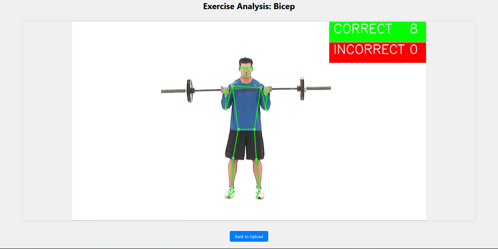
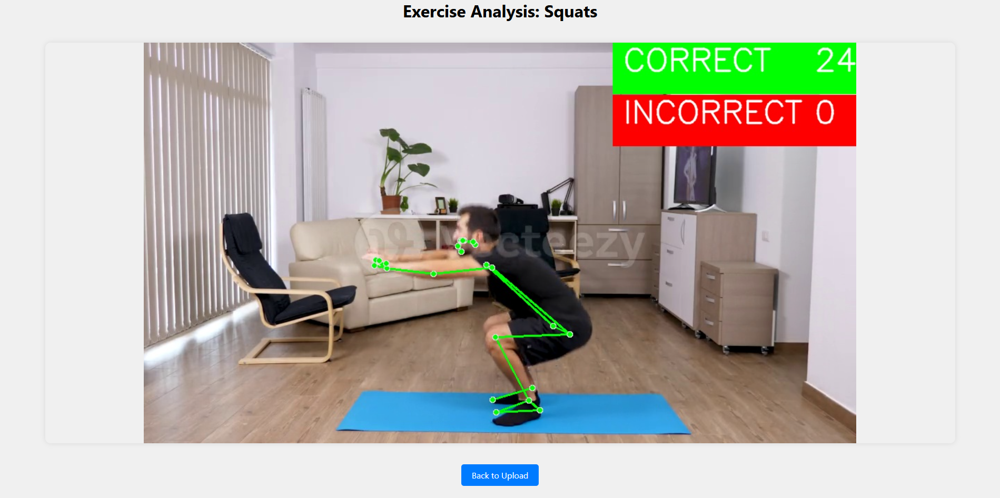

# Real Time Gym - AI Exercise Form Tracker

Real Time Gym is a web application that uses computer vision to analyze and provide real-time feedback on exercise form. Currently supports bicep curls and squats tracking.

## Features

- Real-time exercise form detection
- Counts correct and incorrect repetitions
- Visual feedback with color-coded pose tracking
  - Green: Correct form
  - Red: Incorrect form
- Supports multiple exercises:
  - Bicep Curls
  - Squats

## Exercise Form Guidelines

### Bicep Curls

- Full curl (correct): Arm angle ≤ 30°
- Partial curl (incorrect): Arm angle between 90° and 160°
- Starting position: Arm angle > 160°



### Squats

- Deep squat (correct): Knee angle < 110°
- Partial squat (incorrect): Knee angle between 110° and 150°
- Standing position: Knee angle > 150°



## Setup and Usage

1. Install required dependencies:

```bash
pip install flask opencv-python mediapipe numpy
```

2. Run the application:

```bash
python app.py
```

3. Open a web browser and navigate to `http://localhost:5000`
4. Upload a video file and select the exercise type
5. The application will process the video and provide real-time feedback

## Technologies Used

- Flask
- OpenCV
- MediaPipe
- NumPy
