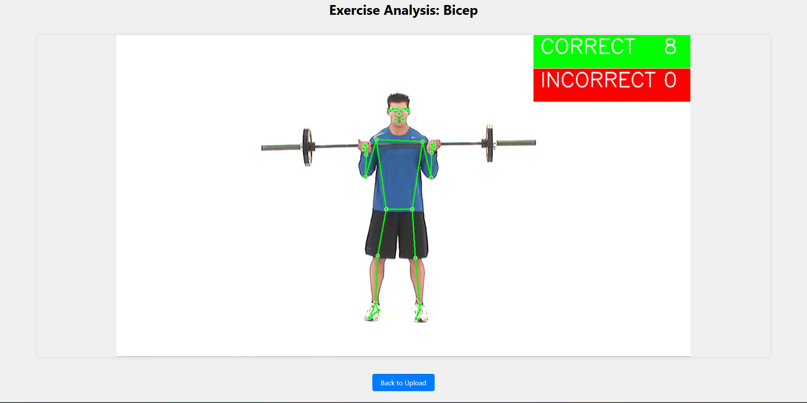
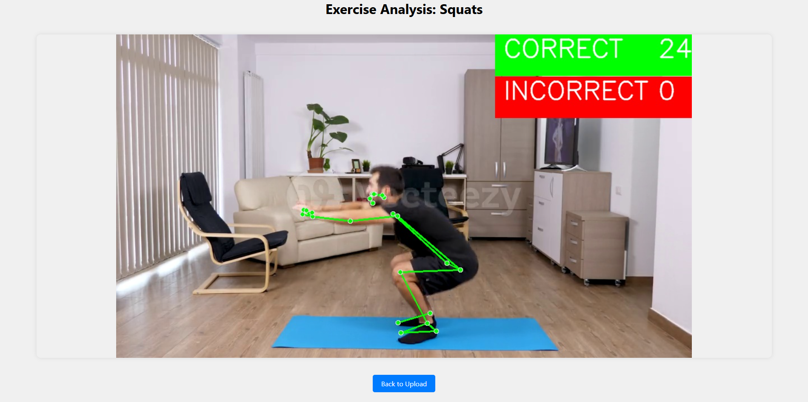

# 🏋️‍♂️ Real Time Gym - AI Exercise Form Tracker

[](https://www.python.org)
[](https://flask.palletsprojects.com)
[](https://opencv.org)
[](LICENSE)

> 🎯 Your personal AI-powered fitness coach that provides real-time form feedback!

<div align="center">
  
</div>

## ✨ Features

- 🎥 Real-time exercise form detection
- 🔢 Smart repetition counting
- 🚦 Visual feedback with color-coded pose tracking
  - 🟢 Green: Perfect form
  - 🔴 Red: Form needs improvement
- 🏋️ Supported Exercises:
  - 💪 Bicep Curls
  - 🦵 Squats

## 📝 Exercise Form Guidelines

### 💪 Bicep Curls

| Position          | Angle      | Status       |
| ----------------- | ---------- | ------------ |
| Full curl         | ≤ 30°      | ✅ Correct   |
| Partial curl      | 90° - 160° | ❌ Incorrect |
| Starting position | > 160°     | ➡️ Ready     |

<div align="center">
  
  <p><i>Bicep Curl Form Detection in Action</i></p>
</div>

### 🦵 Squats

| Position      | Angle       | Status       |
| ------------- | ----------- | ------------ |
| Deep squat    | < 110°      | ✅ Correct   |
| Partial squat | 110° - 150° | ❌ Incorrect |
| Standing      | > 150°      | ➡️ Ready     |

<div align="center">
  
  <p><i>Squat Form Detection in Action</i></p>
</div>

## 🚀 Quick Start

### Prerequisites

- Python 3.7+
- Webcam or video input

### Installation

```bash
# Clone the repository
git clone https://github.com/yourusername/real-time-gym.git

# Install dependencies
pip install flask opencv-python mediapipe numpy
```

### Usage

```bash
# Run the application
python app.py
```

Then:

1. 🌐 Open your browser and go to `http://localhost:5000`
2. 📤 Upload your exercise video
3. 🎯 Select exercise type
4. 📊 Get real-time form feedback!

## 🛠️ Technologies

<table>
  <tr>
    <td align="center"><br />Flask</td>
    <td align="center"><br />OpenCV</td>
    <td align="center"><br />MediaPipe</td>
    <td align="center"><br />NumPy</td>
  </tr>
</table>

## 🤝 Contributing

Contributions are welcome! Feel free to:

- 🐛 Report bugs
- 💡 Suggest features
- 🔧 Submit pull requests

## 📄 License

This project is licensed under the MIT License - see the [LICENSE](LICENSE) file for details.

---

<div align="center">
  Made with ❤️ for fitness enthusiasts
</div>
